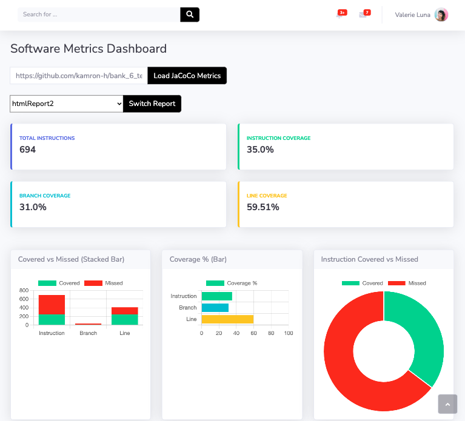
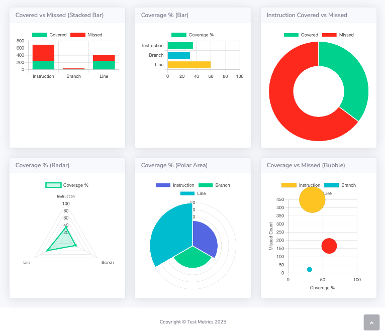

# JaCoCo Metrics Dashboard

A Django + Bootstrap web dashboard that fetches, downloads and parses JaCoCo HTML reports from any public GitHub repo, then visualizes code‑coverage metrics with interactive charts and graphs.

---




---
## Features

- **GitHub URL Input**  
  Enter any public GitHub repository URL (e.g. `https://github.com/owner/repo.git`) and the app will:
  1. Download **all** `htmlReport*` folders under `JaCoCo_Reports/` into `static/data/<repo-name>/reports/`.
  2. Let you pick which report variant (e.g. `htmlReport`, `htmlReport2`, …) via a dropdown.
  3. Parse its summary table using **BeautifulSoup4**.
  4. Render four metric cards and six different chart/graph types with **Chart.js**.

- **bs4 Parsing**  
  In `metrics_app/utils.py`, the `parse_jacoco_html(html, context)` function:
  1. Finds the `<table id="coveragetable">` in `default/index.html`.  
  2. Reads its `<tfoot><tr>` row, which contains:
     - Missed Instructions of Total Instructions (e.g. `442 of 732`)  
     - Instruction Coverage % (e.g. `39%`)  
     - Missed Branches of Total Branches + Branch Coverage %  
     - Missed Lines + Covered Lines  
  3. Splits and converts text like `"442 of 732"` → `missed=442, total=732, covered=290`.  
  4. Builds and returns:
     ```python
     {
       "INSTRUCTION": {"covered":…, "missed":…, "coverage":…},
       "BRANCH":      {"covered":…, "missed":…, "coverage":…},
       "LINE":        {"covered":…, "missed":…, "coverage":…}
     }
     ```
  5. **Extensibility:** By changing the file‐path logic or table selectors, you can adapt the parser to work with other report structures or entirely different metric sources.

- **Charts & Graphs**  
  The dashboard displays **six** distinct visuals:

  | #  | Type             | What It Shows                                                                                   |
  |----|------------------|-------------------------------------------------------------------------------------------------|
  | 1  | **Stacked Bar**  | Covered vs Missed counts for Instructions, Branches and Lines in one stacked bar per metric.   |
  | 2  | **Horizontal Bar** | Coverage % for Instructions, Branches and Lines, laid out horizontally for easy ranking.      |
  | 3  | **Doughnut**     | Proportion of Covered vs Missed **Instructions** in a circular doughnut chart.                 |
  | 4  | **Radar**        | Coverage % for all three metrics plotted radially; strengths extend further from the center.    |
  | 5  | **Polar Area**   | Coverage % “sectors” sized by metric; highlights relative proportions in a radial layout.       |
  | 6  | **Bubble**       | Three bubbles (one per metric) with:  x-axis: Coverage %, y-axis: Missed count, radius: Total count (covered+missed), giving a 3‑D sense of volume.


## Getting Started

**Clone & Install**  
   ```bash
   git clone https://github.com/kamron-h/testing_metrics.git

   cd testing_metrics pip install -r requirements.txt

   python manage.py runserver
   ```

---


